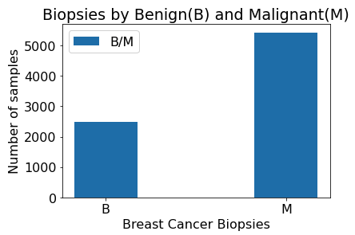
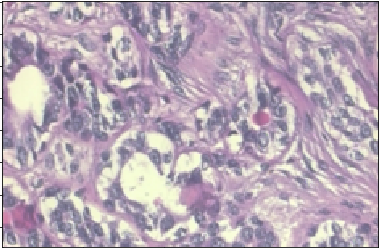
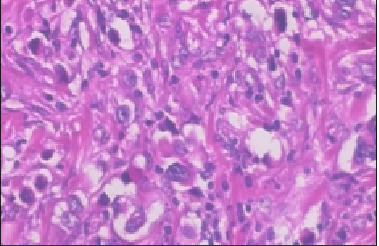
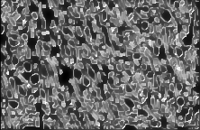
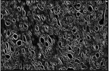
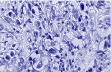
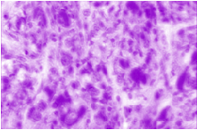
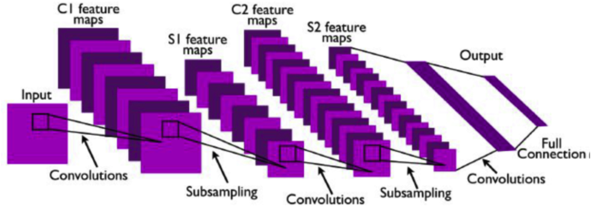
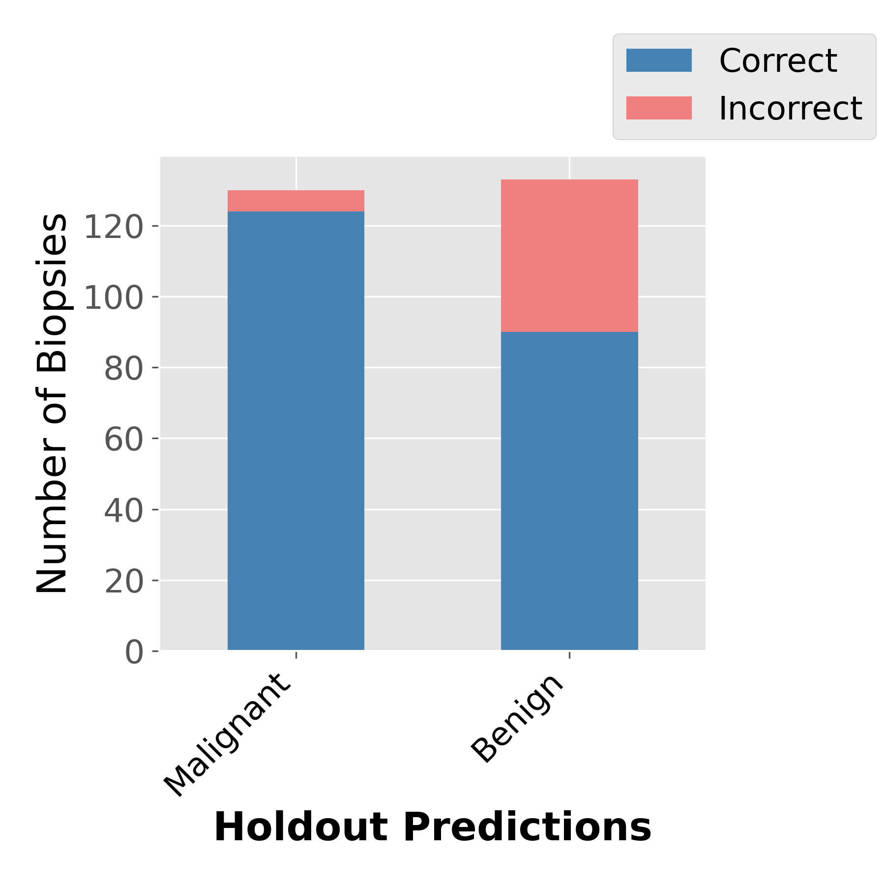

# Breast Cancer biopsy image analysis using a Convolutional Neural Network (CNN)

# Objective
Breast cancer tumor biopsy classification of benign or malignant remains a very manual and subjective process, done by specially trained pathologists.  Breast Cancer is the 2nd leading cause of cancer deaths globally, in women.  Advancing the fight against cancer requires early detection which could be aided by an efficient detection system. 

The goal of this project is to train and tune a convoluted artificial network (CNN) to accurately classify breast cancer biopsies as malignant or benign.  Some recent [studies](https://arxiv.org/abs/1811.12231) suggest CNNs may be biased do better than textures than shapes, implying Deep neural networks are particularly suited to pattern recognition, perhaps gaining better results without first identifying the same features a human would look for.  

# Data Source
I have utilized the [BreakHis](https://web.inf.ufpr.br/vri/databases/breast-cancer-histopathological-database-breakhis/) database, which has been accumulated from the result of a survey by P&D Lab, Brazil in 2014. Breast tissues are taken as samples by the procedure of surgical (open) biopsy (SOB). Samples are stained by hematoxylin and eosin (HE) and produced by a standard paraffin process in which specimen infiltration and embedment are done in paraffin. These histopathology images have a RGB (three channel) TrueColor (8 bits- Red, 8 bits- Green, 8 bits- Blue) color coding scheme. This database contains a total of 7909 images of 700x460 pixel resolution. Images are captured in four different magnification levels, 40X, 100X, 200X, and 400X.  As prior studies have achieved about 5% higher prediction results with the higher magnifications, highest with 200X, I'll focus there with 2013 samples, 623 of which are benign.    

The data is classified as Benign or Malignant, and represents 4 different types of tumor in each classification.  

Benign

 

Malignant 

# EDA 

## Feature Identification / Image Pre-processing
In the visual context, malignant tumors tend to have large and irregular nuclei or multiple nuclear structures. The cytoplasm also undergoes changes, wherein new structures appear, or normal structures disappear. Malignant cells have a small cytoplasmic amount (either intensely colored or on the contrary, very pale), frequently with vacuoles. In this scenario, the ratio of cytoplasm to nucleus decreases. We can use image pre-processing to help "bring forward" the features that may help identify malignant vs benign tumors, to amplify nuclei and cytoplasm and ignore uninteresting features like fatty regions.

*Interesting pre-processing transformations*

Analyzed the following types of image pre-processing, we're looking for patterns we might be able to highlight to make it easier for the model to recongize:

* Best Greyscale filters: Chambolle Denoise, Sobel on a Malignant Carcinoma

  

* Best Color filter: Immunohistochemical staining colors separation: Hematoxylin and Eosin (H&E) Dye separation.  Hematoxylin for nuclei in blue vs Eosin which stains the extracellular matrix and cytoplasm pink, recombine and rescale.  It appears color does help distinguish benign from malignant.

 

These can be superimposed and used as input in place of the full color images to see if any improvement in learning can be gained. 

In the case of supervised learning, we do not need to provide these features explicitly. In this case images are fed to the CNN, along with each class as a label (Benign (B) or Malignant (M)). From the automatic update of filter values in the training process, CNN should be able to extract the computational features. 

# Training / Testing

* 80/20 Train/Test split and 3-fold cross validation to ensure.

Data Augmentation (slight rotation, flip, zoom to produce new samples) Helps Solve:
- Need for more data to train
- Re-balance Benign and Malignant training samples (close to 50/50) initially but removed as this was the source of a data leak and really wasn't necessary as this data is not dramatically imbalanced to have a true minority class. 

The model was trained on a P3 AWS EC2 server with a GPU which brought training time down from about 30 hours to 2 hours. A Docker container was used for Tensorflow, Tensorboard, Scikit-Learn and Scikit-Image locally, but to gain GPU support on EC2, ulimately is was easiest to enable the Deep Learning AMI on the EC2 for the latest tensorflow version. 

# Model Selection

### Choice of Hyperparameters
* Loss function - Sparse_categorical_crossentropy. 
* Optimizer - Adadelta did better at showing a steady decrease in loss rate than Adam or SGD
* Metrics - Recall (also made sure Accuracy, then F-1 aren't terrible)
* Data Augmentation - produced 10 augmented images for each one
* Learning Rate / Epochs - slow

Credit Dabeer et al.

**Table 1. Parameters of the Convolutional Layer Parameters**
| Layer         | L1   | L2   | L3   | L4   | L5   | 
| ------------- |:----:|:----:|:----:|:----:|:----:|
| Type	       | conv | conv | pool | conv | pool |
| Channel	    | 32   | 64	  |  -   | 128	|  –   |
| Filter Size	| 5 × 5| 5 × 5|	–	 |5 × 5	| –    |
| Conv. stride	| 1 × 1| 1 × 1|	–	 |1 × 1	| –    |
| Pooling size	|   -  |  -   | 3 × 3|	–	| 3 × 3|
| Pooling stride|	–  | -    | 1 × 1|	–	| 1 × 1|	
| Padding size  | same |	  |valid |  –	|valid |		
| Activation    | ReLu | ReLu | –	| ReLu | –     |

**Table 2. Details of Fully Connected network**
| Layer Attribute | FC-1   | FC-2   | FC-3   | 
| --------------- |:------:|:------:|:------:|
| No of nodes     |	64	   | 64     |	2   |
| Activation used | Relu   | Relu   |	Softmax |

**Measure**
I choose Recall as a primary measure (although accuracy matters as well) because its a measure of the model's ability to find all the relevant cases within the dataset, or the fraction of the actually malignant that are predicted malignant.

The model favors reducing False Negatives.  There are a higher number of False Positives however which do not come free either; there is a tradeoff.  Adenomas (benign tumors) are more common in women in their 30's and 40's and while they mimmic malignant tumors in many ways, often do no become aggressive and matastestize.  Since the treatment for cancer actually can be harmful, involving procedures, surgeries, and even chemo/radiation, there is some push by health experts to permorm mammograms later. 

** cite source

Cost Measures:

            precision    recall  f1-score   support

           0       0.94      0.68      0.79       134
           1       0.74      0.95      0.84       130

    accuracy                           0.81       264
   macro avg       0.84      0.82      0.81       264
weighted avg       0.84      0.81      0.81       264

Results

# Conclusions:

The model is learning and does okay relative to the AlexNet model that gained a lot of interest in 

Potential Improvements
* More data sources
* Color adjustment for common lab variation
* Transfer Learning with ResNet or Xception
* Deconvolution Net*

To run:
$ python breastcancer_cnn.py -n_epochs 40 -data_multiplier 10

### Cited

"Cancer Diagnosis in histopathological image: CNN based approach" (Dabeer, S., Khan, M.M., Islam, S.) 2019
 https://doi.org/10.1016/j.imu.2019.100231.

"Imagenet-trained CNNs are biased towards texture; increasing shape bias improves accuracy and robustness" (R. Geirhos, P. Rubisch, C. Michaelis, M. Bethge, F.A. Wichmann, W. Brendel)
International conference on learning representations (2019)
https://openreview.net/forum?id=Bygh9j09KX
