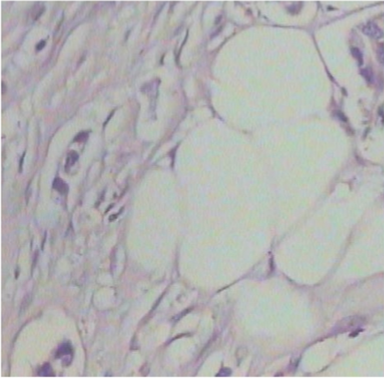
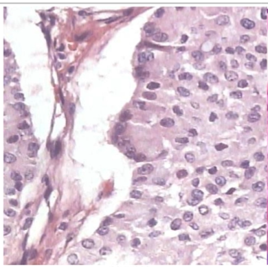

# breast-cancer-cnn
Breast Cancer biopsy image analysis using CNN

# Objective
Breast cancer tumor biopsy classification of benign or malignant remains a very manual and subjective process, done by specially trained pathologists.  Breast Cancer is the 2nd leading cause of cancer deaths.  Advancing the fight against cancer requires early detection which could be aided by an efficient detection system. 

The goal of this project is to train and tune a convoluted artificial network (CNN) to accurately classify breast cancer biopsies as malignant or benign.  Some recent studies (https://arxiv.org/abs/1811.12231) suggest CNNs may be biased do better than textures than shapes, implying Deep neural networks are particularly suited to pattern recognition, perhaps gaining better results without first identifying the same features a human would look for.  Seeking to identify the same features such as pathologists look for is beyond the scope of this project.

# Background and Related Work
Prior work has either sought to pursue feature identification which can then be used to classify using supervised learning techniques.  For example [this paper] acheived an 85% accuracy rate using the PFTAS  .... with a modified version of the presesigned AlexNet network.....   vs the more recent work [this paper] which used an Unsepervised approach to achieve superior results (over 98% accuracy) without need for particular domain knowledge.  
link https://reader.elsevier.com/reader/sd/pii/S2352914819301133?token=053D59F39621088D53B0111C3ED1A28FC32C2D6A08E016BD3DB7C4316F6F06BA75FB0703280AA217C9DB7951EE60C61D

Prior Studies Table
Existing methods and respective Accuracy.  
------
Year    Method Used         Validation Accuracy Range (in %)    Error Rate 
2017    K-Nearest Neighbor [32] 83 to 86 19.28 
2017    Pre-Trained Networks [11] 80 to 89 4.74 
2017    Feature Extracted Using CNN [33] 83 to 90 4.28 
2018    Deep Convolution Neural Network
2019    Cancer Diagnosis in histopathological image: CNN based approach [] 88 to 96 

# Data Source
I have utilized the BreakHis database, which has been accumulated from the result of a survey by P&D Lab, Brazil in 2014. Breast tissues are taken as samples by the procedure of surgical (open) biopsy (SOB). Samples are stained by hematoxylin and eosin (HE) and produced by a standard paraffin process in which specimen infiltration and embedment are done in paraffin. These histopathology images have a RGB (three channel) TrueColor (8 bits- Red, 8 bits- Green, 8 bits- Blue) color coding scheme. This database contains a total of 7909 images of 700x460 pixel resolution. Images are captured in four different magnification levels, 40X, 100X, 200X, and 400X.  As prior studies have acheived about 5% higher prediction results with the higher magnifications, highest with 200x, I'll focus on that particular dataset.    

The data is classified as Benign or Malignant, and represents 4 different types of tumor in each classification.  

# EDA and how to run
The dataset can be obtained here (link)
Needed: Tensorflow with Keras ver 2.3

# Convolving
Using Scikit skimage which is good for feature detection, filtering, contour models, morphology, and classification problems.

Analyzed the following types of image pre-processing

* Chambolle Denoise

* H&E Dye separation (only parts dyed by Hematoxylin for nuclei) vs Eosin which stains the extracellular matrix and cytoplasm pink

Starting set of slides (one for each type of tumor)

- Choose greyscale or ID prominent colors?  There is significance between e.g. pink, blue, purple and brown because the HE dyes highlight
< description here >
Can we isolate the differences by identifying the prominent colors? 
Immunohistochemical staining colors separation:

- After identifying the outline
<images here>

# Feature Identification
A study has shown that the human brain is sensitive to shapes, while computers are more sensitive to patterns and texture, [28]. Because of this fact, feature learning is entirely different for manual versus machine. In the visual context, malignant tumors tend to have large and irregular nuclei or multiple nuclear structures. The cytoplasm also undergoes changes, wherein new structures appear, or normal structures disappear. Malignant cells have a small cytoplasmic amount, frequently with vacuoles. In this scenario, the ratio of cytoplasm to nucleus decreases [29]. All of these features are examined by experts, or algorithms are developed to quantify these features to automate detection. This approach is difficult and imprecise as selection and quantification involve various unknown errors that are hard to address. In the case of supervise learning, we do not need to provide these features explicitly. In this case images are fed to an architecture such as CNN, along with its class as a label (Benign or Malignant). From the automatic update of filter values in the training process, CNN is able to extract the computational features. In short, for a given architecture of CNN filters and their weights, are features that are used at the time of testing for model evaluation

# Training / Testing

How to find the best hyperparameters for the CNN?

Initial selections and why
* number of filters
* dimensions of convolution layer
* dimensions of pooling layer (reduces dimensions, reduces variance)

How to evaluate, 

Use 5-fold Cross Validation to compare different hyperparameter selections.
e.g.  Loop through:
Optimizer learning rates: 0.01 through 0.00001 (1e-5)
Activation functions
epochs - for patterns, need slow learning, more epochs

# Model Selection

!(picture of C1 S1 maps) CNN architecture

# Choice of Hypterparameters

1. Structure
2. Activation functions
    2a. ReLu (Rectified Linear Unit) - does well with positive numbers (true for images)
    2b. Softmax in the last layer.  When we want to next classify into the specific types of tumor (multiple classifications), this will facilitate multiple output classifications.
3. Weight and bias initialization
4. Training method
5. Regularization - yes.  We're going for a deeper model, and then use regularization to reduce overfit
6. Weight decay
7. Random seed - we should try some different ones to help detect/avoid reaching a local minimum in our Gradient descent within our model, used for optimizing the parameters by the model.

* Loss function - <formula here>
* Gradient Descent method:  Batch/Mini-batch/Stochastic.  We're using stochastic 
   Optimizer = keras.io/optimizer of SGD for Stochastic Gradient Descent.  Our activation function has a derivative at all points, so this should perform well. 

Table of Cost Measures with different parameters:

Cited

Cancer Diagnosis in histopathological image: CNN based approach (Dabeer, S., Khan, M.M., Islam, S.) 2019
 https://doi.org/10.1016/j.imu.2019.100231.

